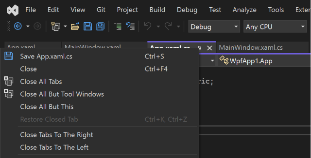

# CloseSidesTabs

You can download this extension from the [VS Marketplace](https://marketplace.visualstudio.com/items?itemName=davidedz.CloseSidesTabs)

## Credits
This is a copy of the [CloseTabsToRight](https://github.com/billpratt/CloseTabsToRight) extension made by [billprat](https://github.com/billpratt).

It has been adapted to work with Visual Studio 2022.

## Features

- Close tabs on the right of the selected document
- Close tabs on the left of the selected document

## License
[Apache 2.0](LICENSE)
